# How to create a Badge

Badges are one of the core elements of the BYU Computing Boot Camp. They motivate those who use our site to put their newly-learned skills to the test by attempting a 
pass-off assessment, and acts as evidence of their knowledge after being earned. The badges we issue are OpenBadges, which contain json metadata with the cerification 
and qualification information so that it can be verified as real and assert the recepient knowledge. We are currently using Badgr to 
issue these badges with their easy-to-use API. The users can then download the badges directly onto their computers as png files (with the aformentioned metadata), 
and/or store it in the Badgr wallet. 

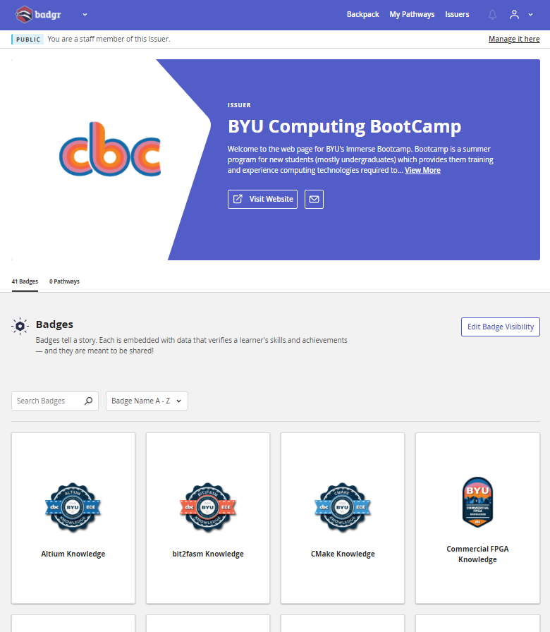

This guide will explain how to create a badge for new modules and sub-modules on the site, as well as giving access to all currently-existent badges. Be sure to read all of the sections, as the "Existing Badges" sections gives alot of context for creating new ones, and might just contain the badge you wanted to make.

## Existing Badges
The BYU Computing Boot Camp already has tons of badge designs that are ready for use. They can be found at the following link, as pngs and as their Adobe Illustrator 
Project Files: [TO DO] . The png files are ready to be uploaded to Badgr, and the Adobe Illustrator files can be used to edit/create badges. 

There is a badge created for almost every module and sub-module currently on the site as of July 2021. For example, the module "Software Development" has it's own Module Badge that looks like this:

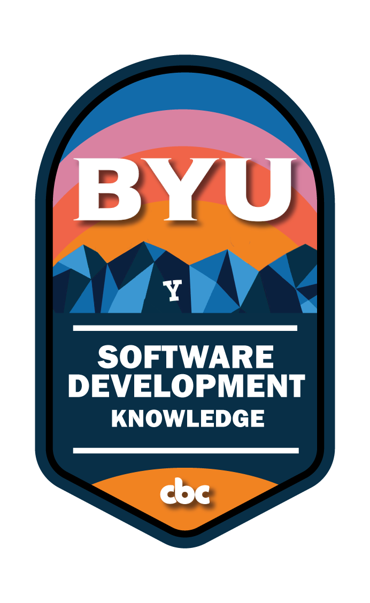

Each of the modules on the site have their own Module badge. 

Most of the sub-modules have their own Mini-badges. For example, the sub-module "Git" under the module "Software Development" has it's own Mini-badge that looks like this:


Almost all of the sub-modules have their own Mini-badge. A few don't have a Mini-badge because they represent too little knowledge to justify
a reward (like "Install Vivado/Vitis"), or they are a duplicate of another sub-module (like "Github" under "PCB", which covers the same knowledge as "GitHub" under
Software Development").

#### Mini-Badges
Mini-Badges are the easiest badges to earn, and represent the smallest amount of knowledge. For example, to earn the "Make" Mini-badge, one must write two Makefiles that
implement functionality taught in the Make sub-module. This means that the Make Mini-badge will represent experience writing functional Makefiles, but not much else. For
this reason, the badge designs are simple yet elegeant. They clearly state the skill that was learned near the top, and state at the bottom that the recepient has a
"knowledge" of the skill. It is not an "expertise", due to the limited amount of code that they have to implement. The Mini-badges also have three logos on them, the Computing
Boot Camp logo on the left (cbc), a logo for Electrical and Computer Engineering on the right (ECE), and the BYU seal in the middle. These logos add legitimacy to the badge, 
represent who issued it, and add to the asthetic appeal of the Mini-badge.

Mini-Badges are color-coded, with the color on the ribbon representing which Module they fall under. The colors are taken from the 4 main colors found on the website 
banner, with the badges using the exact color on the banner, or a slight variation of the color on the banner. 

"Software Development" Mini-badges are light blue, which is a variation of the blue on the website banner.


"Commercial FPGA" Mini-badges are pink, which is taken off of the website banner.

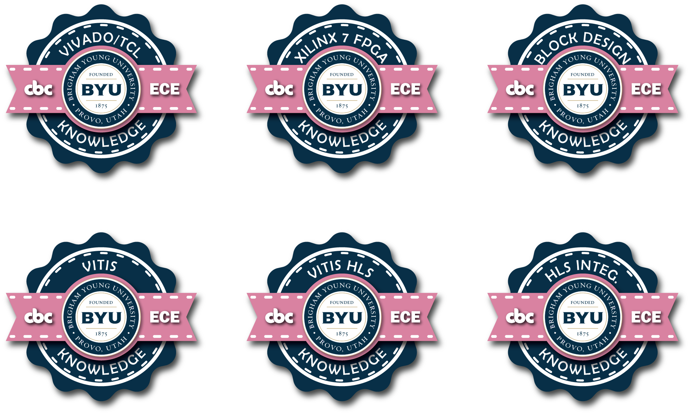

"Open FPGA CAD" Mini-badges are tomato red, which is taken off of the website banner.


"Robotics" doesn't have any sub-modules yet, and so doesn't have any Mini-badges. When they are made, they should have a unique color based off of the colors in
the website banner.

"Networking" Mini-badges are orange, which is taken off of the website banner.


"PCB" Mini-badges are blue, which is taken off of the website banner.

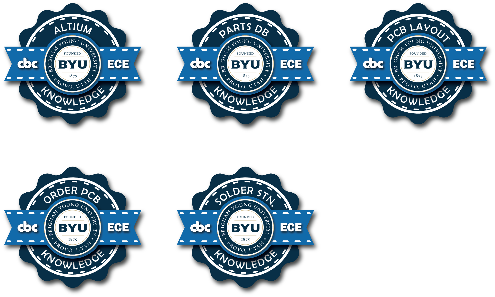

When creating a new Mini-badge under an existing module, be sure to make sure the color of the ribbon matches the color of the other Mini-badges under the same module.

#### Module Badges
Module Badges are the hardest to earn, and represent the largest amount of knowledge. This is due to the fact that to earn the Module Badge, one must earn all of the
Mini-badges in all of the sub-modules for that modules. For example, if the user wants to earn the "Software Development" Module Badge, they must earn 14 Mini-badges, 
from "Git" all the way to "Matlab". This means that the Softwawre Development Module Badge will represent experience in all sorts of different software concepts, which
will make it alot more valuable. The idea is that the Mini-badges will help the user be motivated to keep learning and to keep track of their progress, while the
Module badges are what will actually be shared with employeers and educational institutitions as a certification of their skill. Both types of badges could be used
for both purposes, but they will generally fulfill the previously specified roles better.

Here are all six of the Module Badges:


#### Computing Boot Camp Badge (idea, not currently implemented)
I have been considering having one badge that represents a knowledge in ALL of the modules taught on the Computing Boot Camp site. This badge would be earned by earning all six
of the Module Badges (or a badge for every Module on the site), and would represent skill in every single topic covered on the site. This would be the ultimate show of learning
in Electrical and Computer Engineering, so instead of saying "Electrical and Computer Engineering Knowledge", it could say "Electrical and Computer Engineering Expertise", or something similar.

We don't currently have a design for this badge. It could be a modified version of the Module Badges, or one we haven't used yet. For this reason, I'm leaving all of my unused
badge design concepts with the rest of the badges in a folder called "Unused". If you want to try and create the Computing Boot Camp Badge, you could try to adapt one of those
designs if you'd like.

## Creating a new Badge
To create a new badge, you are going to need access to Adobe Illustrator, a vector graphics editor and design program, since that's what I used to create the badges. Adobe Illustrator comes as part of the Adobe Creative Cloud, which is free for full-time employees of BYU, and available at a discount to BYU Students for $69 a year (instead of $624 a year). See the following link for information: https://adobe.byu.edu/. You could also just buy Adobe Illustrator for $252 a year, but I wouldn't recommend it, since you can get ALL of the programs at a lower price.

The process for creating new badges will vary based on the type of badge you are creating.

#### Creating a Mini-Badge in a pre-existing Module
For a new Mini-Badge in a pre-existing module, all you have to do is locate the design files for the previously designed Mini-badges in that module, and then just copy those designs with the name of the new sub-module. First, go to <TO DO>. Here, you'll be able to see .ai files, which is the file format that Adobe Illustrator uses for storing design information. You should see the following files:
  
- CommercialFPGAMiniBadges.ai
- NetworkingMiniBadges.ai
- OpenFPGACADMinibadges.ai
- PCBMiniBadges.ai
- SoftwareDevelopmentMiniBadges.ai

Note that if you want to make a Mini-Badge in the Robotics Module, there haven't been any Mini-Badges created for it, so for all intensive purposes, it's like it's a new module. See the section "Creating a Mini-Badge in a new Module" for more information.
  
Click on the .ai file with the name of the Module you want to create a Mini-Badge for. This should open up Adobe Illustrator (assuming you have access to it). You should see a page like this (note that in this example, I clicked on the CommercialFPGAMiniBadges.ai file):
  


This is the standard view for editing Illustrator files. You can see each of the previously made Mini-badges are surrounded by white squares. These squares are called ArtBoards, 
and they make it easy to export all of the badges as seperate images. All you need to know is that when you make a new badge, you want it to have an Artboard behind it. So, let's do that. On the left bar, click on the following symbol, which is the Artboard Tool:
  
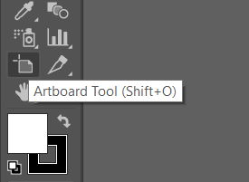
  
The screen should then change to look like this:

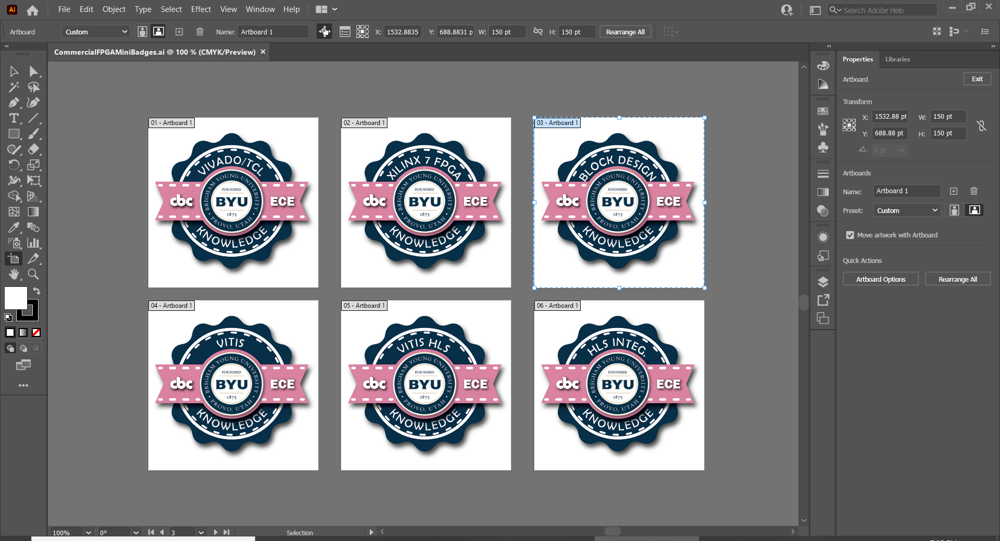
  
Now you should see labels for all of the Artboards on the screen. Left-click on the last Artboard, and you should see it light up with a blue outline, like Artboard 06 in this example:
  
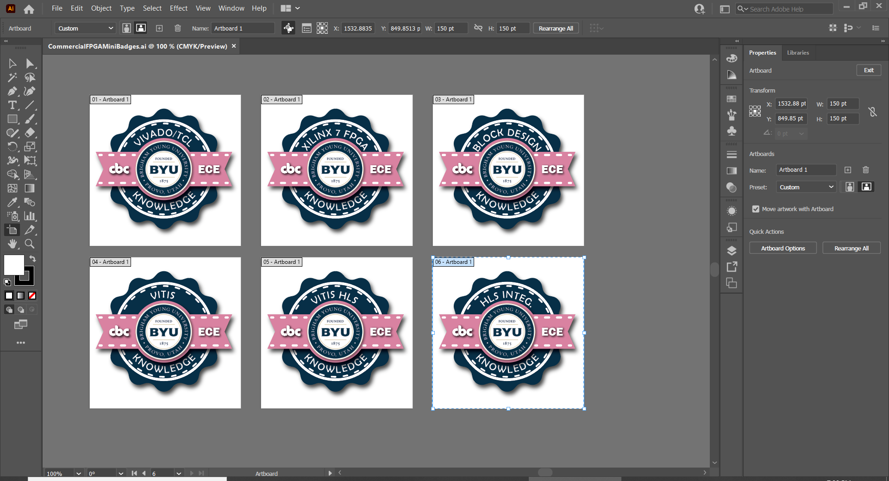
  
Now, hit Ctrl-C, and then hit Ctrl-V. This will copy both the Artboard, and the badge inside it, making a new Artboard for the new Mini-badge:
  
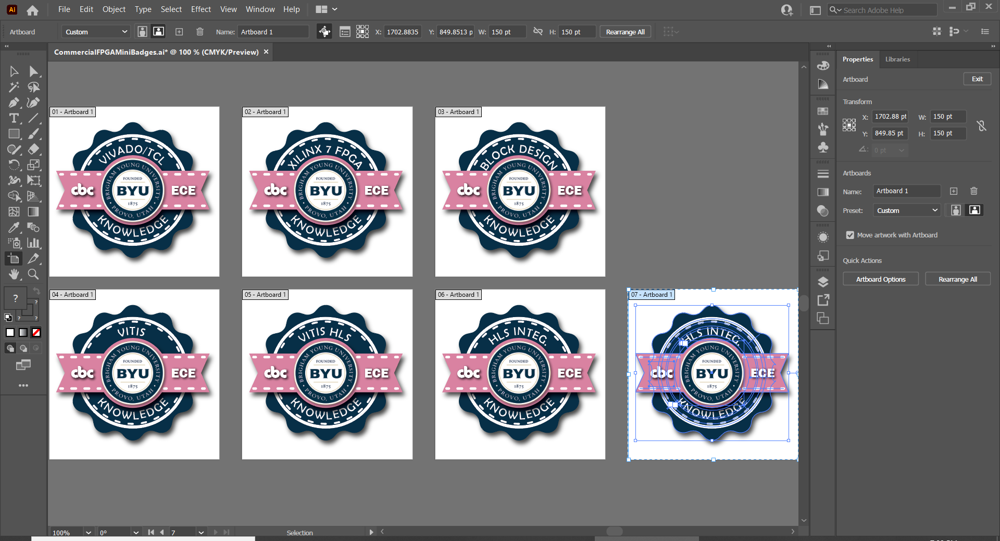
 
If you want to reposition it, you can left click and drag on the new artboard to move it to a new position. You can use the bars on the bottom and right sides of the view to change your preview of the badges as well. I moved my badge down and to the left, so that I could have three badges on each row:
  

  
Now, you can start editing the badge to make it unique. The only thing you'll need to change is the text on the upper-rim of the badge, since the color of the ribbon will stay the same. Click on the Type Tool on the Left Bar, so that you can edit the text on your new Mini-badge:
  
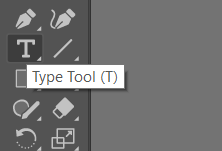
  
Hover over the text on the top of the badge. It should turn blue, like this:
  
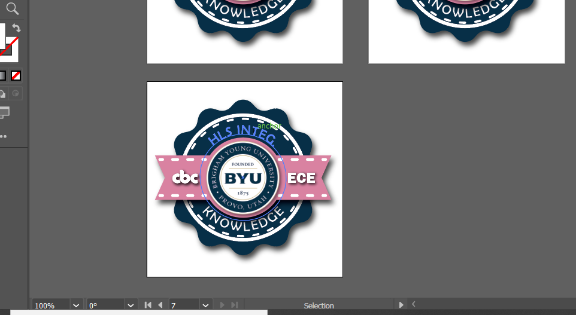
  
Now, left-click on it. A cursor should appear on the text:
  
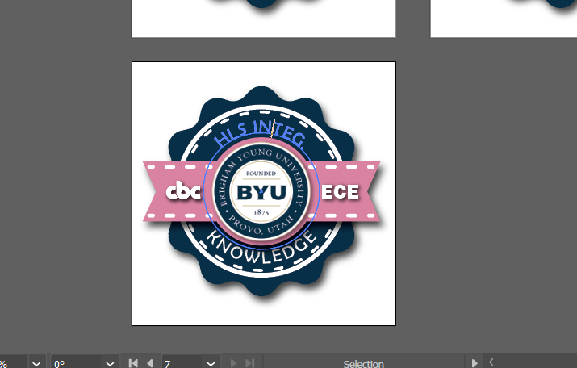
  
Change the text to match the subject or skill of the sub-module that the badge will be for. In my example, let's assume that this badge was for a new sub-module called "Debugging", so I'll change the text to say "DEBUGGING" (Notice that it should be in all caps, to match the other badges):
  

  
You can now see that the text isn't perfectly centered in the badge anymore. Let's fix this. Click on the Selection Tool:
  

  
This tool will allow us to rotate the text back into a centered position. You should now see a box around the middle of the badge. This box represents the text object. Put your cursor close to one of the four corners of the box, and then left-click and drag to edit the rotation of the text. Let go when you think it's centered. Repeat this process until you've successfully centered the text on the badge. To make it easier to see, you can also hold down Ctrl and Alt, and then use the mouse wheel to zoom in or out.
 
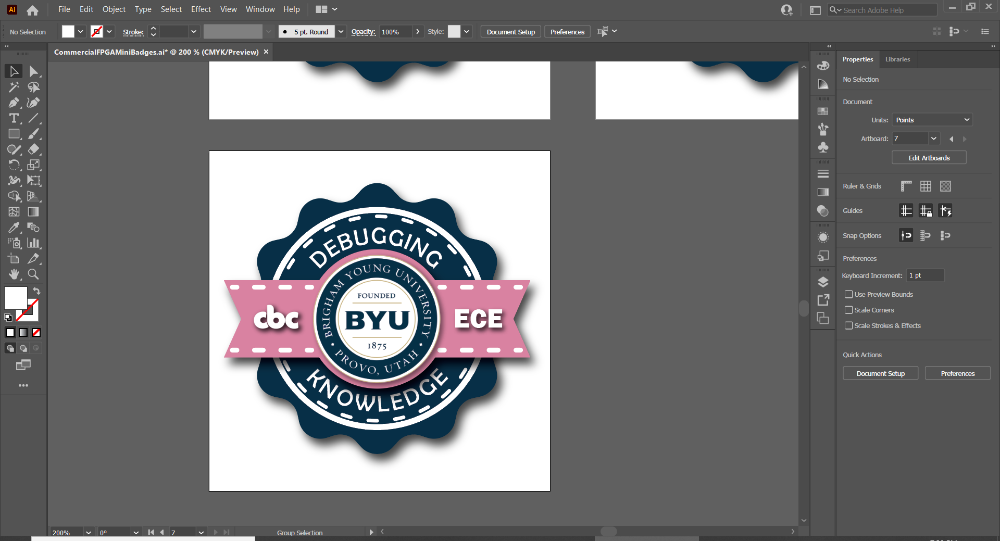
  
Note that if the box goes away for any reason, you can make it come back by left-clicking on the text.
  
Now your badge is made! All you need to do is export it as a png file. Click on "File" at the top of the screen, then "Export", and then "Export as...":
  
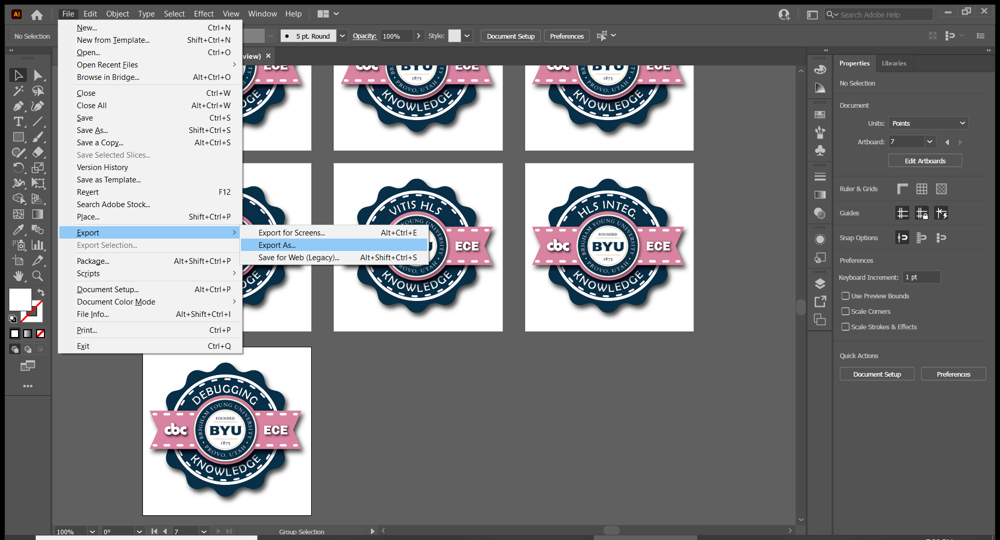
  
You should see a window like this pop-up:
  
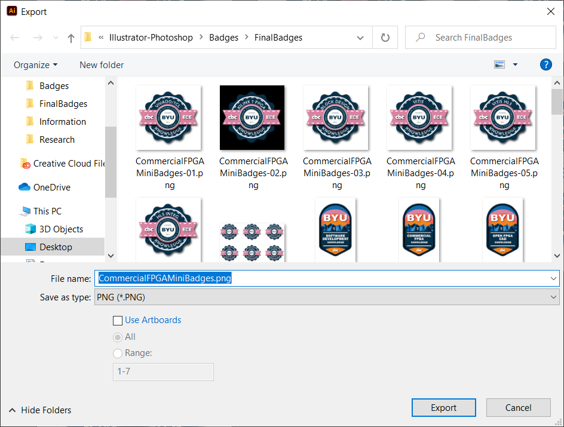
  
Now, just check the "Use Artboards" box and hit "Export":
  

  
Congradulations! Your new badge should now be in the same folder as all of the other badges in the sub-module. Be sure to upload it to ______________________.
  
Now, all that's left is to upload it to Badgr so that it can be awarded to the site's users. See the section "Uploading a Badge to Badgr" below for more information.
  
#### Creating a Mini-Badge in a new Module
Since the module is new, the Mini-badge will be the first one that you create. This means that in addition to doing most of the steps found in the section "Creating a Mini-Badge in a pre-existing Module", you'll have to create a new .ai file for the Mini-badges of this module, and pick a color for it.
  
To start, locate the "CommercialFPGAMiniBadges.ai" file at __________________________, and open it up with Adobe Illustrator. You should see a screen that looks like this:


  
We're going to copy a badge from this file, to use as a starting point for our new .ai file. Click on "File" in the top left, and then click "New...":

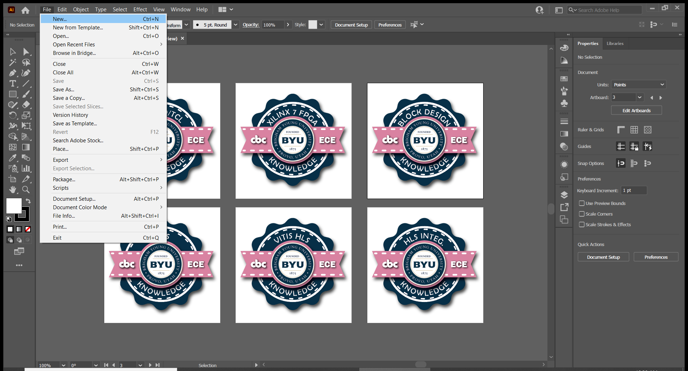

You should see a window pop-up that looks like this:
  
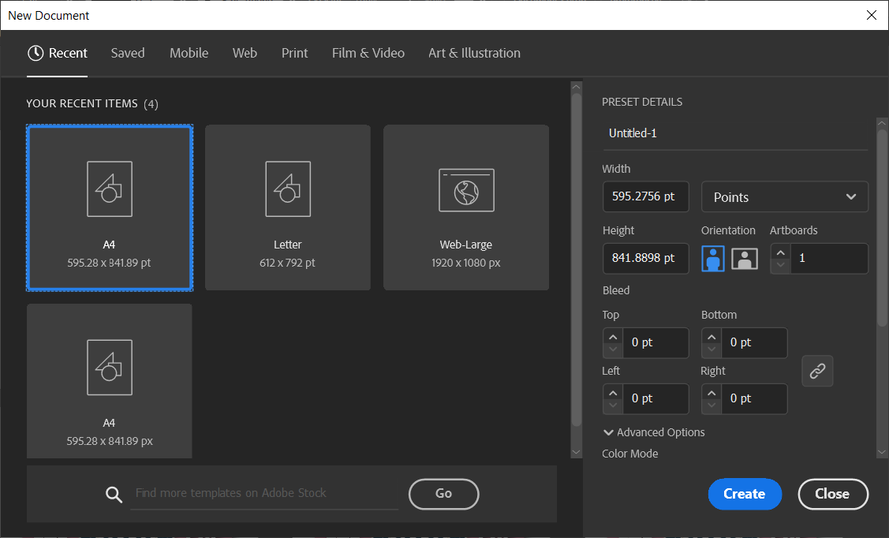
  
Under "Preset Details", it should say something like "Untitled-1". Change this, so that it says the name of the new module, followed by "MiniBadges", like this:

```
<ModuleName>MiniBadges
```
  
Let's assume that the new module that I was making a Mini-Badge for was called "Game Development". So, I'd type in something like this, and then hit "Create":
  
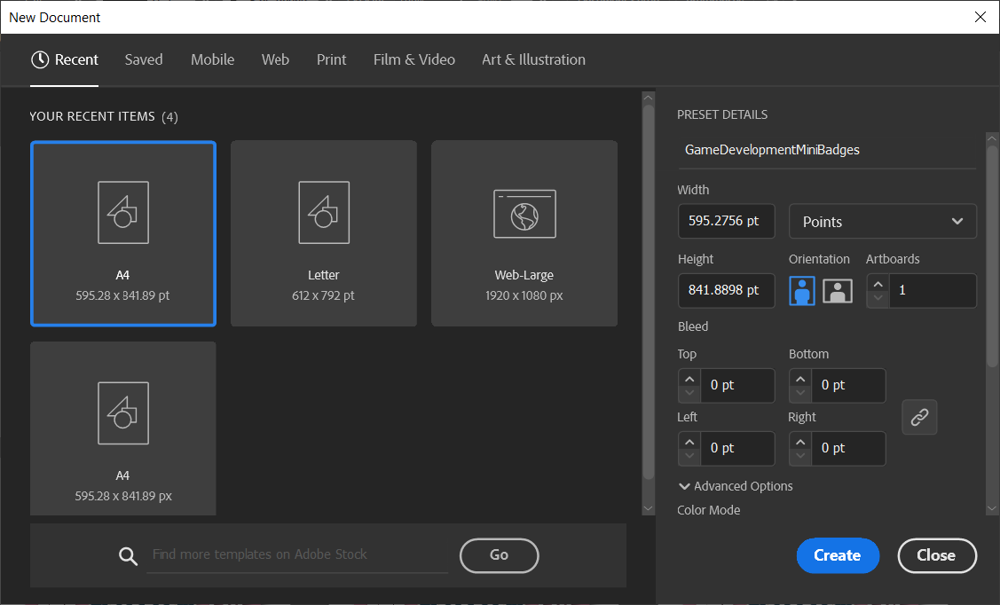

Now, you should see the new file open up:
  

  
Notice that the top bar of the view now has two files listed, "CommercialFPGAMiniBadges.ai" and "GameDevelopmentMiniBadges.ai". By clicking on the name of the file, you can switch
the view to focus on the contents of that file.
  
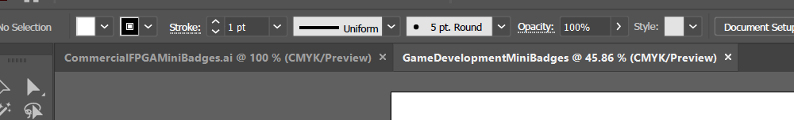

Use this to switch back to CommercialFPGAMiniBadges.ai:
  
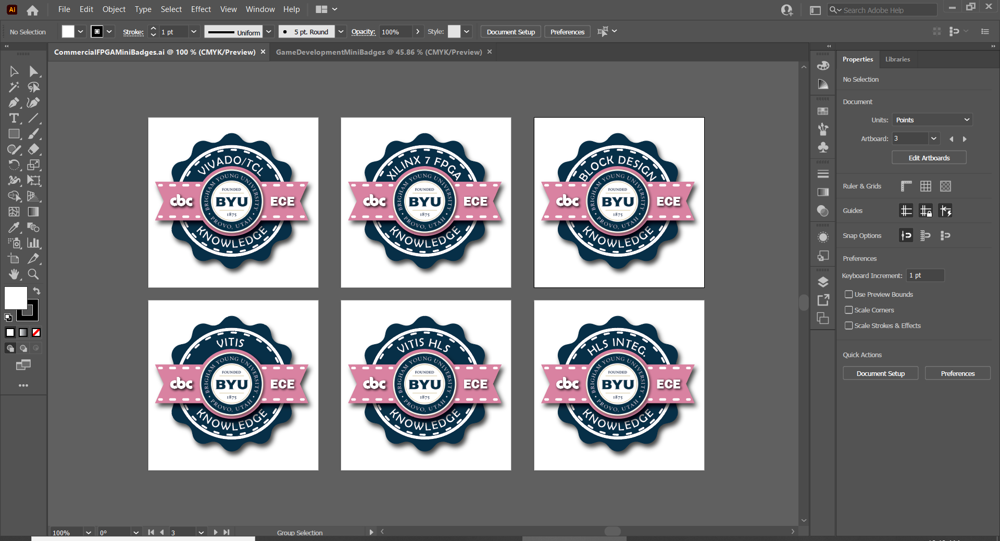
  
Click on the Artboard tool on the left bar:
  

  
This will allow us to copy one of the badges (with it's Artboard behind it) to the new file. Left-click on one of the white squares with a badge, and then hit Ctrl-C. Navigate to your new .ai file, and then hit Ctrl-V. You should see the badge appear in the new file:
  
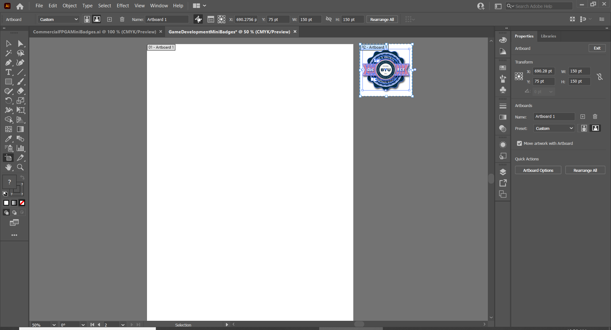
  
Left-click on the giant white Artboard, and hit delete. We don't need it. Use the bars on the right and bottom of the view to center yourself on the newly copied artboard, and use Alt with the mouse wheel to zoom so that it fills most of the screen.
  
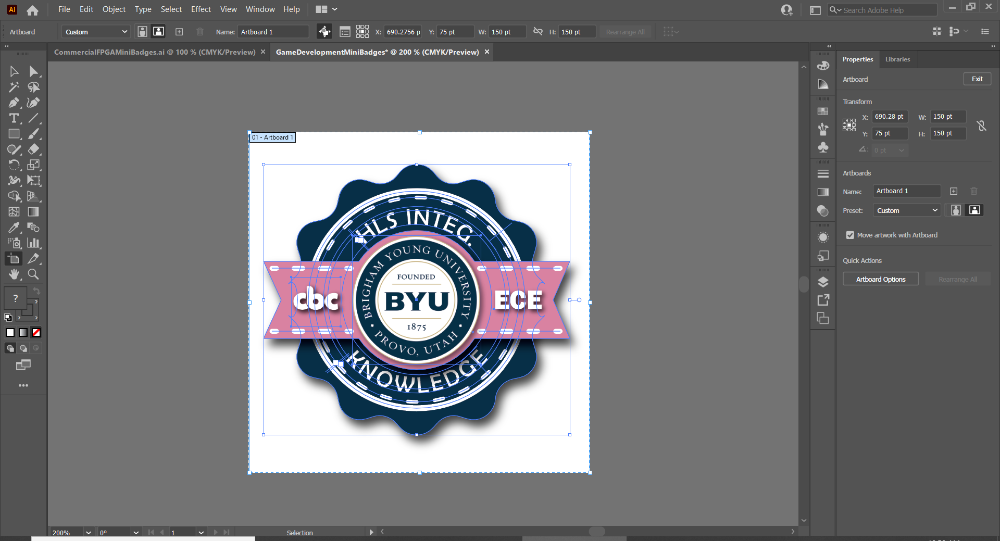
  
Now we need to change the text to match the subject or topic of the first sub-module in our new module. Since I'm pretending that this is for the "Game Development" module, let's pretend that the sub-module is called "Unity Game Engine". With that context in mind, I'll change the top text to say "Unity". Go to the "Creating a Mini-Badge in a pre-existing Module" section and follow the instructions for changing the upper text and centering it:
  
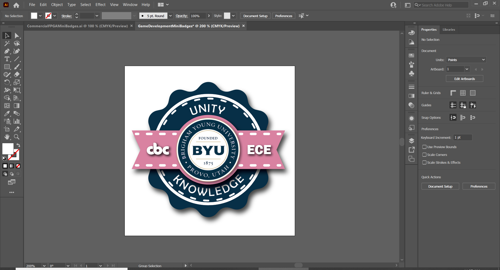
  
Now, the only thing that needs to be changed is the ribbon color. As described in the "Existing Badges" section of this guide, each Mini-badge has a colored ribbon that corresponds to its module. For example, Commercial FPGA Mini-badges have pink ribbons, and Software Development Mini-badges have light blue ribbons. The color should be similar to one of the colors on the Computing Boot Camp Website's top banner, but no two modules should have the same color. See the "Mini-Badges" section above for all of the currently used colors.
  
With this information in mind, let's pick a new color to assign to the Game Development Mini-Badges. First, click on the ribbon of the badge, so that a box appears around it. 
  

  
Next, double click on the colored square that matches of the color of the ribbon on the left side of the screen:
  
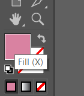
  
This should cause the Color Picker window to pop-up:
  
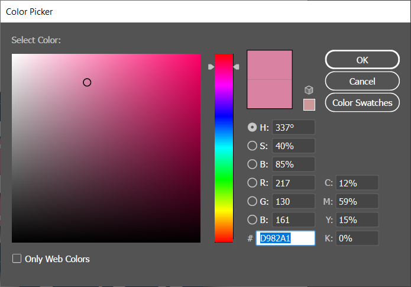
  
Now let's put in the values for one of the Computing Boot Camp colors so that you have a color to start with. In the bottom-right of the color picker is a "#" with 6 characters after this. This is a hexadecimal representation of the color currently selected. We can put in the hexadecimal value of a color we want to start with there. The colors on the BYU Computing Boot Camp banner are as follows:
- #f18321 for Orange
- #f26448 for Tomato Red
- #d882a1 for Pink
- #0a69a8 for Blue
  
I picked Tomato Red to start out with, so after putting #f26448 into the box, I saw this:
  
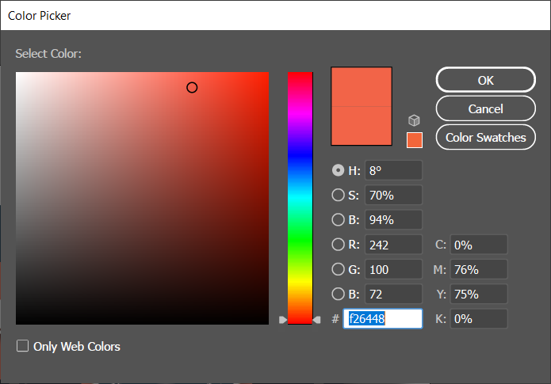
  
Now, using the options in the color picker, mess around until you find a similar color that you like. I ended up with this:
  
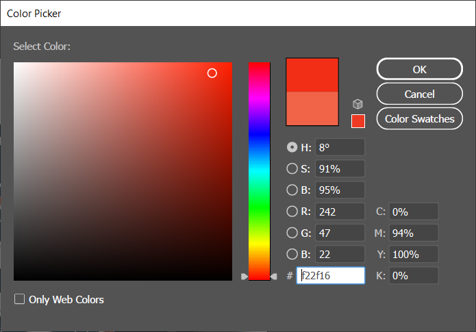
  
Now, just hit "Okay":
  
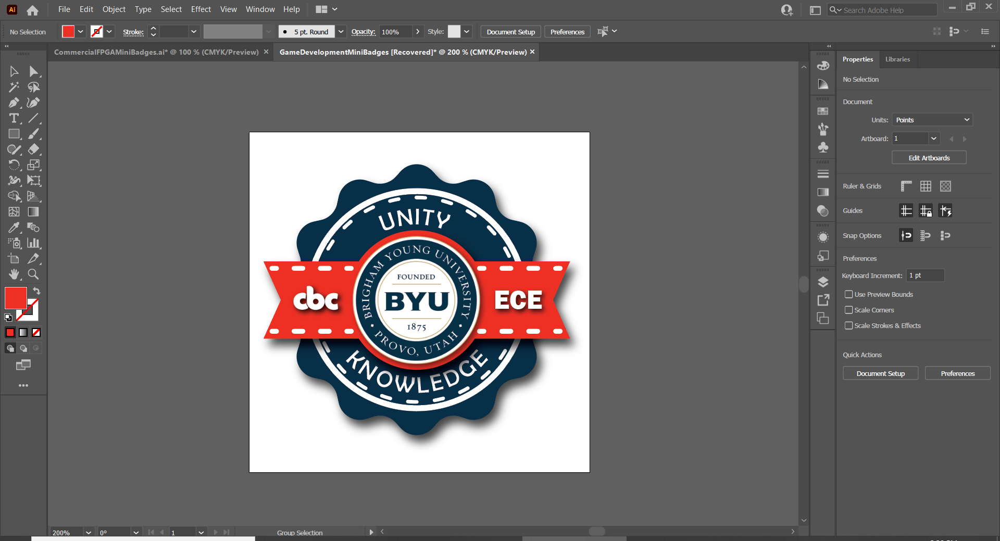
 
Now your first badge is made! All you need to do is export it as a png file. Click on "File" at the top of the screen, then "Export", and then "Export as...":
  

  
You should see a window like this pop-up:
  

  
Now, just check the "Use Artboards" box and hit "Export":
  

  
Congradulations! Your new badge should now be __________________________________. Be sure to upload it to ______________________.

Now, all that's left is to upload it to Badgr so that it can be awarded to the site's users. See the section "Uploading a Badge to Badgr" below for more information.  
  
#### Creating a Module Badge
When you create a new Module Badge, you'll follow the same process as found in the section "Creating a Mini-Badge in a pre-existing Module", except that instead of picking one of the MiniBadges.ai files, you use the "ModuleBadges.ai" file. You'll also need to change the text that is in the middle of the badge instead of the text on the top of it.
  
While editing the text, you may find that the text is too big or too small for the available space. If this happens, you can change it's size. Left-click on the text with the Selection Tool, and then click and hold on one of the four corners. While holding the Shift and Alt buttons on the keyboard (in addition to the mouse), drag the text so that it's bigger/smaller. Holding Shift and Alt will stop the text from being distorted.
  
If the text is no longer centered in the badge after changing it, left-click on the text with the selection tool, and then use the arrow keys to move the text up, down, left, and right, until you believe it's centered. 
  
#### Uploading a Badge to Badgr
Now that the badge designs are made, we just need to upload them to Badgr so that they can be issued to users, either manually or through automated pass-off tests. Badgr is an easy (and currently free) system for awarding, storing, and sharing badges across the Internet. First, we'll need to go to their site at https://badgr.com/:
  


Now, click on the "Sign In" button in the top-right of the screen:
  
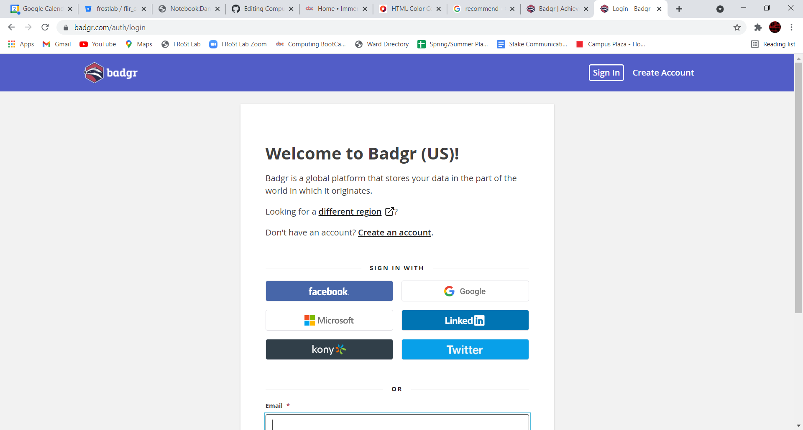
  
Now, you'll need to log-in with the byucomputingbootcamptests@gmail.com as the email. Daniel Butterfield in Professor Mangelson's FRoSt Lab has the password, so contact him for access:
  
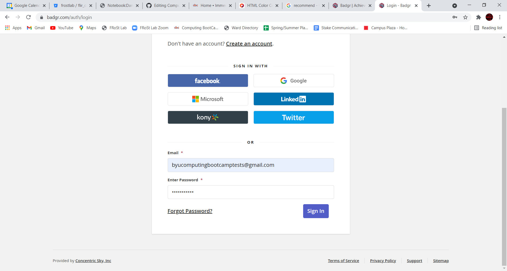
  
Now, you should see a page that looks like this. This shows all of the "Issuers" that the byucomputingbootcamptests@gmail.com has access to. Simply put, an Issuer is a distinct entity that awards badges. Since the BYU Computing Boot Camp is a distinct entity, it has it's own Issuer.
  
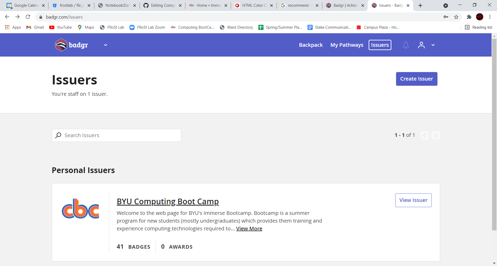
  
Click on the BYU Computing Boot Camp Issuer:
  

  
Here, you can see all of the badges that the BYU Computing Boot Camp currently has, a brief description, and info on Staff and available Pathways. To upload a badge, click on the "Create Badge" Button on the right side of the screen, which will lead you here:
  
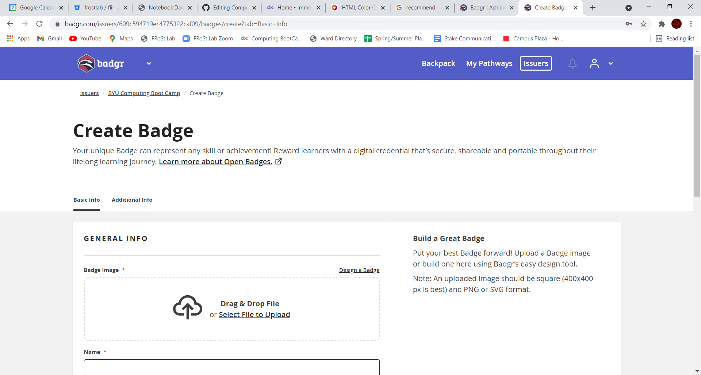
  
Now, upload the file of the new badge you created in the "Badge Image" section. 
  
The "Name" will be the text that is on the badge (look at the other badges for reference).
  
The "Description" is an important part of the badge, as it helps to set a professional tone and gives legitmacy to the award. Depending on the badge that you are making, you'll want to use a template so that all of the badge descriptions can follow the same format.
  
For a Mini-Badge, use this template:
  
```
The recipient of this badge has shown their knowledge and expertise with [skill or ability], having [exercises done in follow-up activities and pass-off tests]. They are certified by the BYU Computing BootCamp to have a knowledge of [skill or ability], and they are ready to use it in the workforce.
```
 
For example, the Make Knowledge Badge has the following description:

```
The recipient of this badge has shown their knowledge and expertise with Make and Makefiles, having written Makefiles to compile and clean C++ programs. They are certified by the BYU Computing BootCamp to have a knowledge of Make and Makefiles, and they are ready to use it in the workforce.
```
  
For a Module Badge, use this template:
  
```
The recipient of this badge has shown their knowledge and expertise with [module name], having earned the [number of mini-badges in module] Mini-badges in the [module name] Module in the BYU Computing Boot Camp. This means that they have used and proved their proficiency with [list of all skills learned in sub-modules]. They are certified by the BYU Computing Boot Camp to have knowledge off all of these subjects, and they are ready to use them in the workforce.
```
  
For example, the Software Development Knowledge Badge has the following description:
```
The recipient of this badge has shown their knowledge and expertise with Software Development, having earned the 14 Mini-badges in the Software Development Module in the BYU Computing Boot Camp. This means that they have used and proved their proficiency with Git, GitHub, VS Code, Makefiles, CMake, Python, Python Environments (especially Conda), Python Packages, Unit Testing, Sphinx Documentation, Docker, SQL Basics, and Matlab. They are certified by the BYU Computing Boot Camp to have knowledge off all of these subjects, and they are ready to use them in the workforce.
```
  
The "Description" in "Earning Criteria" is a different field entirely, and is meant for outlining the specific activities undertaken by the user to earn the badge. This field remains empty until we have a pass-off test for the badge. When we have made the pass-off test, we can fill it with the specifications that the test requires. For example, since the Make Knowledge badge already has a pass-off test, it's earning criteria description reads as follows:
  
```
The recipient of this badge has implemented the following Makefiles:

## Problem 1 - Makefile1.txt

Write a Makefile that implements the following functionality. You'll store the contents of this Makefile at "MakeFiles/MakeFile1.txt". It
should be very simple, and shouldn't use variables, automatic variables, pattern matching, or Makefile functions. It should have the following two rules:

#### tree:
This rule should be the first rule in the file. It should be called "tree", and it should generate an executable called "tree" with the g++ compiler. It should use 7 files to do so, including leaves.c, leaves.h, branches.c, branches.h, roots.c, roots.h, and main.c.

#### clean:
This rule should be called "clean", and it should remove the "tree" executable if there is one.

## Problem 2 - Makefile2.txt

Write a Makefile that implements the following functionality. You'll store the contents of this Makefile at "MakeFiles/MakeFile2.txt". It
will be complicated, and shouldn't have the words "main", "leaves", "Leaves", "roots", "Roots", "branches", or "Branches" anywhere in the file. It should have at least the following three rules:

#### $(TARGET):
This rule should be the first rule in the file. It should be called "$(TARGET)", and it should generate an executable called "tree" with the g++ compiler. It should use all of the .h and .c files found in the directory. Then, it should save the names of all the files that it used in a text file called "compiled.txt".

#### %.o:
This rule should be called "%.o", and uses pattern matching to generate all the necessary .o files for the $(TARGET) rule.

#### clean:
This rule should be called "clean", and should remove the tree executable, compiled.txt file, and the .o files.
```
  
Finally, the "Criteria URL" should point to the pass-off test (if the badge has one), to the sub-module page (if it's a Mini-badge), or just to the main page of the Computing Boot Camp if the other two don't work.
  
Now, just hit the "Create Badge" button in the bottom-right of the screen:
  
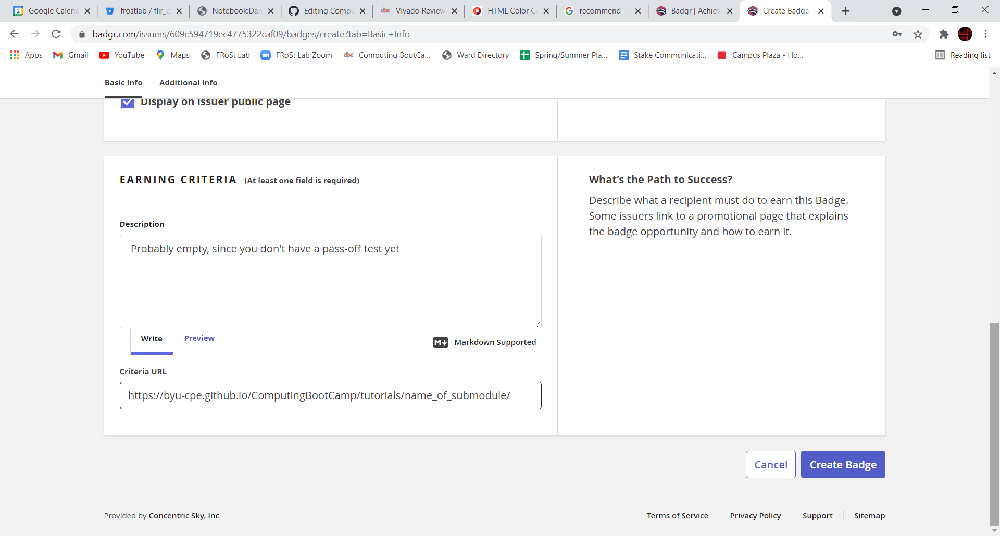
  
Congradulations! Your new badge is now ready to be issued to users. Whenever you want to award it, use the "Award Badge" button in the middle of the screen, or see the page "How to create Automated Pass-off Tests" for information on how to issue this badge with an API call.
